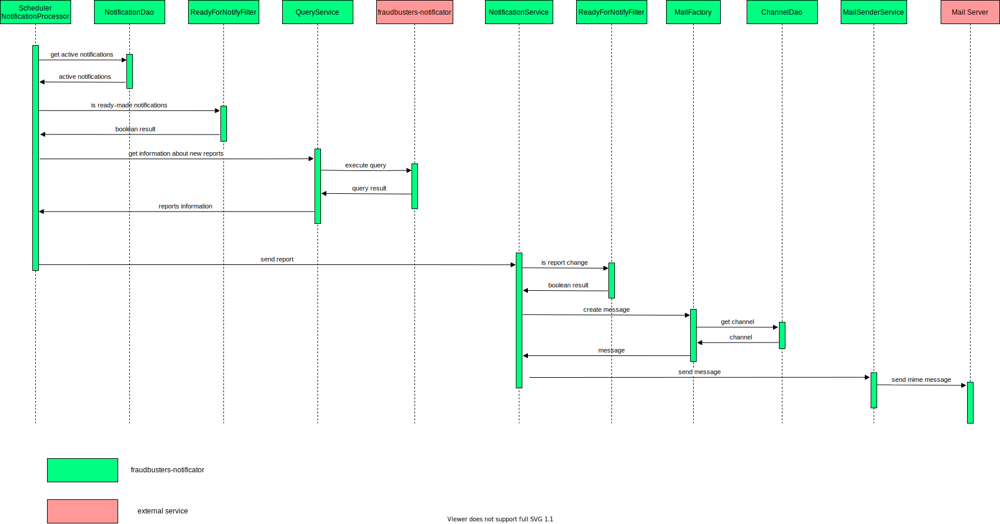

# fraudbusters-notificator

fraudbusters-notificator - сервис предназначен для работы с оповещениями антифрода (Fraudbusters).

В функции сервиса входит:

- управление оповещаниями - добавление, изменение, удаление (CRUD)

- управление каналами передачи опопвещаний

- рассылка настроенных оповещений по выбранным каналам

## Описание работы сервиса

Сервис предоставляет возможность гибко настраивать оповешения и осуществлять их запланированную отправку по различным
каналам. Оповещения строятся на базе шаблонов. Шаблоны оповешений представляют из себя преднастроенную группу
параметров, изменение которых необходимо отслеживать в оповещениях. Для работы с оповещениями необходимо перейти в
раздел "Notifications" системы Fraudbusters.

Общая схема взаимодействия:

Протокол взаимодействия описан [тут](https://github.com/rbkmoney/fraudbusters-notificator-proto).